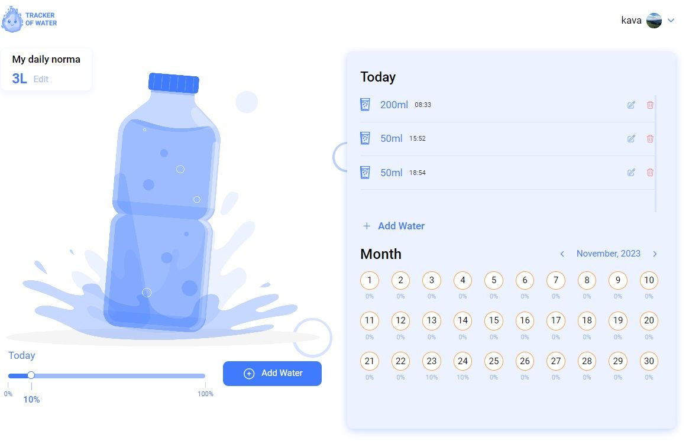

# WaterTracker


## Description

**WaterTracker is a recycling application designed to monitor water consumption.
It is designed using React to create an efficient and user-friendly interface.**

## Getting Started

1. Clone the repository:

```
git clone https://github.com/ishkov2709/watertracker.git
```

2. Navigate to the project directory:

```
cd watertracker
```

3. Install dependencies:

```
npm install
```

4. Run the application:

```
npm start
```

## Project Structure

**src**

- **components**: Reusable React components
- **constants**
- **hooks**: Custom React hooks
- **img**
- **pages**: Components representing individual pages of the application.
- **schemas**: Field validation schemes
- **store**: Redux Store
- **styles**: Style files
- **utils**: Helper functions

## Demo



## Used Libraries

**_Frontend_**

- **React.js**
- **React Router**
- **Redux Toolkit**
- **Redux Persist**
- **React-Toastify**
- **React Spinners**
- **styled-components**
- **Formik**
- **Yup**
- **react-range**
- **date-fns**
- **Axios**
- **PropTypes**

**_Backend_**

- **Node.js**
- **Express**
- **MongoDB**
- **Mongoose**
- **Joy**
- **Nodemailer**
- **Cloudinary**
- **Swagger**

## Swagger

[Swagger API Documentation](https://water-tracker.onrender.com/api/docs)
